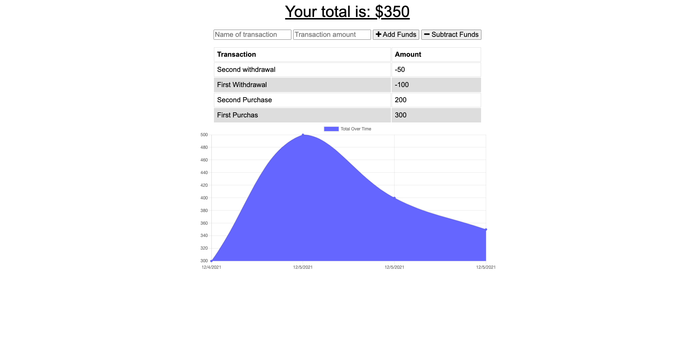

# budget-tracker

## Table of Contents

* [Description](#description)
* [Deployment](#deployment)
* [Usage](#usage)
* [License](#license)
* [Questions](#questions)
## Description
An application that used MongoDB to build a PWA budget tracker that allows you to see changes in spending, and how much money is currently in the budget.
## Screenshot

## Deployment
https://rocky-fjord-26704.herokuapp.com/

## Installation

To run this application, please do the following installation:

`
npm i
`

## Usage
Type in a name for your transaction, and enter the amount. Choose whether it is an addition or subtraction, and your budget will be represented in a graph

## License

This application is covered under the MIT license.
## Questions

Email for any questions at [Andrew Durham: andrewdurham1094@gmail.com](mailto:andrewdurham1094@gmail.com).

